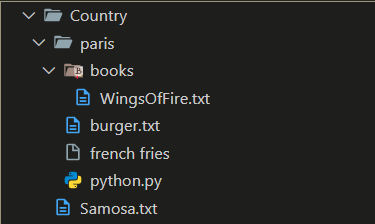
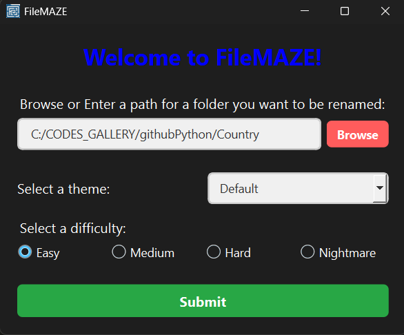
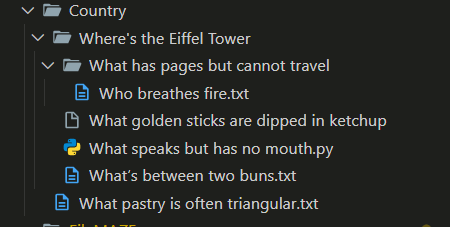
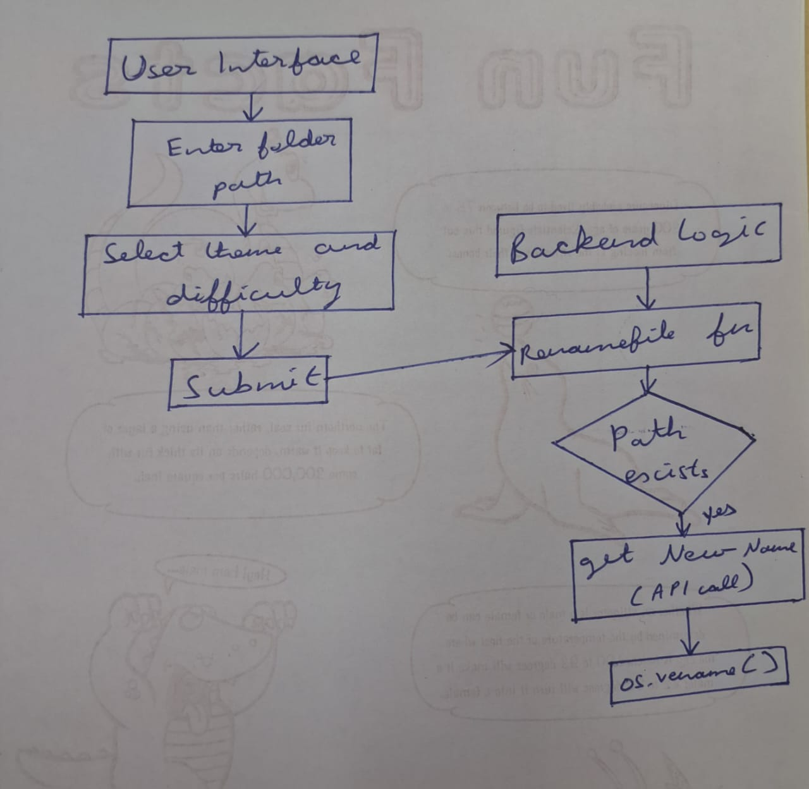

# FileMAZE 🌀

>Where your files become riddles, and productivity goes to die.

## Basic Details
### Team Name: Byte Me


### Team Members
- Team Lead: Ajay Krishna D - Model Engineering College
- Member 2: Abhay Murali M - Model Engineering College

### Project Description
FileMAZE is a completely useless file renamer that transforms your directory into a confusing, riddle-filled labyrinth. Every file and folder is renamed into a trivia question, absurd riddle, or anime-level nonsense - and it just keeps getting worse.

### The Problem (that doesn't exist)
Navigating your files is too easy, too predictable. Why find resume.docx in 2 seconds when you could embark on an existential trivia quest?

### The Solution (that nobody asked for)
We recursively rename your entire folder structure using AI-generated riddles, trivia, and themed nonsense. With modes like Pirate, Shakespeare, and Anime - confusion is guaranteed. 

## Technical Details
### Technologies/Components Used
For Software:
- Languages: Python
- Frameworks: PySide6 (for GUI)
- Libraries:
    - pyinstaller for app packaging
    - os, threading, etc. for file chaos
    - Gemini API for question generation
- Tools:
    - Gemini API
    - GitHub
    - VS Code

### Implementation
For Software:
# Installation

```bash
git clone https://github.com/Abhay-77/FileMAZE
cd FileMAZE
pip install -r requirements.txt
```

# Run

```bash
python GUI.py
```

### Project Documentation
For Software:

# Screenshots (Add at least 3)


*Original folder structure before the chaos begins - neat, organized, and boring.*



*The FileMAZE UI: Select a folder, choose your theme and difficulty level, then unleash confusion.*



*After entering the maze: files renamed into riddles and trivia questions - good luck finding your stuff.*

# Diagrams


*Workflow of FileMAZE: User selects a folder → Chooses theme → AI renames recursively → UI displays taunts.Final build of the application with the interactive GUI ready to prank your files.*

### Project Demo
# Video
[Video](https://drive.google.com/file/d/1NZknO0tYyHg5E9OZP-6hroC_msaW9sR1/view?usp=sharing)
*A complete walkthrough of FileMAZE in action - from selecting your innocent folder, to launching the chaos with our themed UI, and finally revealing the transformed directory full of riddles, questions, and glorious confusion.*

## Team Contributions
- Ajay Krishna D : UI development (PySide6) & packaging
- Abhay Murali M : Prompt Engineering & AI powered renaming logic

---
Made with ❤️ at TinkerHub Useless Projects 


